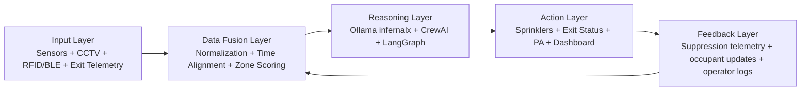

# INFERNAL X Fire Pipeline

## Purpose

This document translates the fire-response architecture described in `ref/INFERNAL_X_Final_Done.pdf` into the current repository implementation.

The goal is to make the system understandable as both:

- a simulation-first prototype
- a real-time deployment pipeline ready for sensor and camera integration

## End-to-End Fire Pipeline

## Ordered Sensor Collection

The input layer should always be processed in this order:

1. Environmental sensors
2. CCTV camera observations
3. RFID and BLE occupant localization
4. Exit telemetry
5. Sprinkler telemetry

This order matters because it lets the system:

- establish fire evidence first
- confirm or reject it with visual evidence
- then route occupants using the latest hazard state
- then confirm actionability of exits and suppression hardware

## Collection Schedule

Recommended real-time schedule based on the project report:

- CCTV inference: aggregate 30 FPS camera feeds into 1-second decision windows
- environmental sensors: every 1 second
- RFID and BLE localization: every 2 seconds
- exit status telemetry: every 1 second
- sprinkler telemetry: every 1 second
- fusion output publish cycle: every 500 milliseconds or faster

## Current Repository Implementation

### Input Layer

Implemented files:

- `sensor_pipeline.py`
- `sensor_interface.py`
- `sensor_demo_packet.json`

Supported data types:

- temperature
- smoke / obscuration
- CO / gas
- camera flame and smoke scores
- occupant sightings from RFID/BLE style sources
- exit availability
- sprinkler telemetry

### Data Fusion Layer

The data fusion logic now lives in `sensor_pipeline.py`.

It performs:

- zone-name normalization
- legacy payload normalization
- fire probability scoring per zone
- intensity classification
- occupancy estimation
- blocked-exit inference
- suppression feedback incorporation
- tracked-occupant snapshot generation

Each fused zone contains:

- fire probability
- intensity
- temperature
- smoke level
- CO level
- blockage score
- occupant count
- suppression state
- evidence list
- spread direction

### Reasoning Layer

The reasoning layer uses:

- local Ollama model `infernalx`
- `agents/crew.py`
- `agents/langgraph_flow.py`
- `server.py` chat and summary routes

The reasoning layer receives fused fire and occupancy state and can produce:

- suppression recommendations
- exit priorities
- PA messages
- operator summaries

### Action Layer

The action layer is currently simulated inside `server.py`.

It now reacts to the fused pipeline through:

- fire creation in zones whose fused probability is high
- blocked exit registration
- route recalculation that avoids blocked exits and hazardous zones
- updated dashboard state
- operator-accessible sensor snapshot APIs

## Real-Time Deployment Pipeline

For a real building deployment, the recommended path is:

### Stage 1. Device Ordering and Registration

For each installed device, store:

- device id
- zone id
- floor id
- device type
- calibration date
- sampling interval
- communication protocol
- fail-safe mode

### Stage 2. Edge Collection

Use one edge collector process per floor or per device cluster to gather:

- sensor packets over MQTT, Modbus, HTTP, Serial, or vendor SDKs
- camera inference outputs from the CCTV model
- RFID reader events
- BLE beacon triangulation updates

Each packet must be timestamped at ingest time and signed with:

- building id
- packet id
- source id
- ingestion timestamp

### Stage 3. Fusion Bus

Push all normalized packets into the fusion bus.

The fusion bus must:

- validate schema
- reject stale or malformed packets
- fuse packets into zone states
- expose the latest building snapshot to the reasoning engine

### Stage 4. Reasoning and Validation

Run the reasoning stack only after fusion output is complete.

Before any action is applied:

- validate the decision schema
- verify zones exist in the current layout
- reject suppression to unavailable hardware
- reject evacuation routes through blocked exits or active fire zones

### Stage 5. Action Execution

Publish commands to:

- motorized sprinklers
- PA systems
- digital signage
- operator dashboard
- mobile notifications

### Stage 6. Feedback Loop

Collect:

- sprinkler flow rate
- fire reduction signals
- camera re-checks
- occupant movement changes
- exit clearance changes

Then feed that data back into fusion and rerun reasoning.

## Current FastAPI Endpoints

The project now exposes these sensor-related endpoints:

- `GET /api/sensor_snapshot`
- `POST /api/sensor_ingest`
- `POST /api/sensor_demo`

Use `POST /api/sensor_demo` to load the included presentation packet from `sensor_demo_packet.json`.

Use `POST /api/sensor_ingest` for real or staged payloads.

## Example Sensor Packet

The repository includes `sensor_demo_packet.json` as a clean example.

It demonstrates:

- fire in `Zone Beta (Engineering)`
- smoke drift into `West Corridor`
- `Exit Beta North` reported blocked
- occupant sightings from RFID and BLE

## Simulation Bridge

The current simulation consumes the fusion output in this way:

1. high fire probability causes the simulation to spawn fire in that zone
2. blocked exits are removed from evacuation routing
3. tracked occupants can update simulated people when ids match
4. chat and summaries include the latest sensor-fusion summary

## What Is Already Real In Code

- local sensor packet schema
- ordered input pipeline
- fusion engine
- fire probability scoring
- blocked exit inference
- simulation bridge
- sensor APIs
- markdown documentation for presentation

## What Still Needs Real Hardware

- MQTT / Modbus / BLE adapters
- real CCTV inference worker
- database-backed device registry
- physical sprinkler controller
- real PA and signage output channels

## Presentation Line

Use this line during presentation:

`INFERNAL X now contains a concrete fire pipeline that starts with ordered sensor and camera ingestion, fuses the incoming data into zone-level risk state, reasons over that state with Ollama and multi-agent orchestration, and feeds the results back into live suppression and evacuation simulation.`
